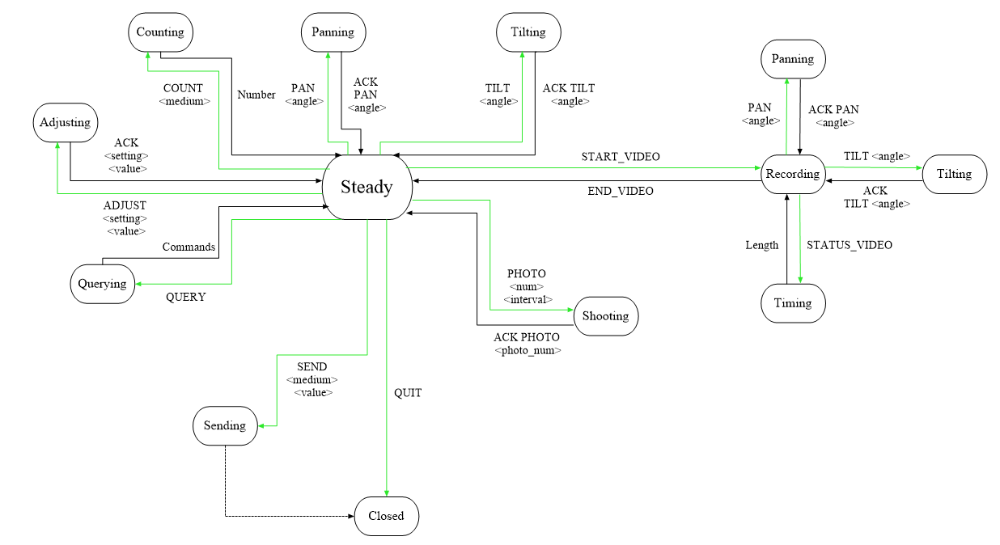
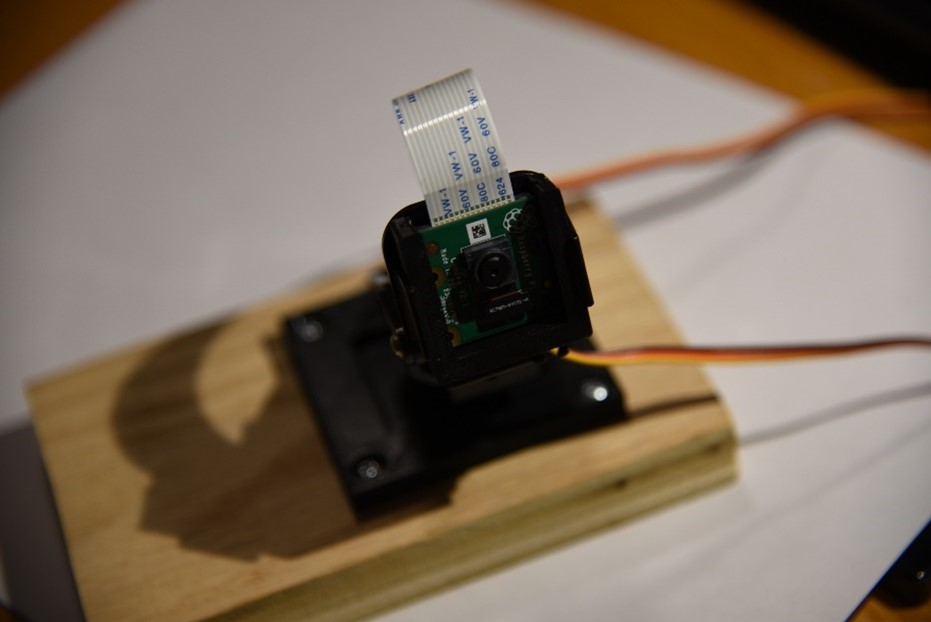
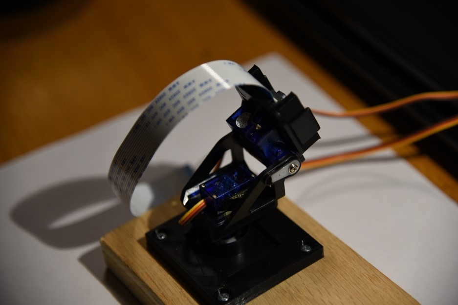

# RPi-Camera-Control
**Final project for CSCI 420: Networking**

Christianna Fisk

### Project Objectives
In this project, I worked on creating an application-level protocol for remote control of a camera, specifically for the RPi.

### Principles of Networking Involved
* Client-Server Model
    * The server: the RPi (with the camera attached)
    * The client: my laptop
* One-to-One Transmission
    * Only one computer at a time can connect to the RPi and issue commands to the camera
* Built on top of TCP
    * The connection between the server and the client is established via TCP
    * To ensure reliability:
      * Especially for pan/tilt movements
    * Not a real-time application
      * No real need for timeliness since video is not being streamed
* Creation of an application-level protocol

### Contributions
* Thanks to:
  * Dr. Robert Willhoft for the initial TCP connection code
  * Camera setup from https://projects.raspberrypi.org/en/projects/getting-started-with-picamera
  * Code to control RPi pan and tilt servo from https://www.instructables.com/Raspberry-Pi-Cam-Pan-Tilt-Control-Over-Local-Inter/
  * Code to transfer files using Sockets in Python based on code from https://www.thepythoncode.com/article/send-receive-files-using-sockets-python
* Personal Contributions:
  * Designing a state diagram
    * Visualizing states, commands, and acknowledgements
  * Determining valid commands 
    * Text-oriented, with a tag and possible values
  * Outlining how the server parses commands

### Overview of Possible Commands
* QUERY
  * Checks all commands
* ADJUST \<setting\> \<value\>
  * Adjusts a setting for the RPi camera
  * Currently, the only setting available is *rotation*, which can be set to 0º, 90º, 180º, or 270º
* COUNT \<medium\>
  * Returns a count of *photos* or *videos* taken thus far
* PAN \<angle\>
  * Pans the servo to an *angle* between 30º-150º
* TILT \<angle\>
  * Tilts the servo to an *angle* between 30º-150º
* START_VIDEO
  * Begins recording
  * Once recording, the only valid commands are END_VIDEO, STATUS, PAN, and TILT
  * Each video is labeled by a number initially set to 1
* END_VIDEO
  * Ends recording
* STATUS_VIDEO
  * Only valid when recording is in process
  * Checks current length of video in minutes and seconds
* PHOTO \<num\> \<interval\>	
  * Takes *num* photos, each separated by *interval* seconds
  * Each photo is labeled by a number initially set to 1
* SEND \<medium\> \<value\>
  * Sends either the *photo* or the *video* with the appropriately labeled *value*
* QUIT
  * Closes the socket

  
### State Diagram
Once the connection has been established, the RPi camera enters into the 'Steady' state. This state diagram then visualizes the possible states of the RPi camera, displaying the commands that move the camera into the state and the acknowledgements that are sent back to the client as the camera moves back into the 'Steady' state.

  
### Getting Started
Items Required:
* Raspberry Pi
* Raspberry Pi Camera Module
* Pan and Tilt Servo
* Breadboard
* Wires

  
   

Initial Setup:
* Wiring the RPi camera and pan/tilt servo:
  * Insert the Camera Module ribbon cable into the Camera Module port
    * ENSURE YOUR RPI IS TURNED OFF!
    * Make sure the connectors at the bottom of the ribbon cable are facing the contacts in the port
  * The two servo motors:
    * Brown – GND
    * Red/Orange – 5V
    * Yellow – GPIO 19 and GPIO 6
* On the RPi, you should have *rpi_server.py*, an *images* folder, and a *videos* folder.
* On your laptop (or client), you should have *client.py*, an *images* folder, and a *videos* folder.

Running the Code:
* On the RPi, run '*python3 rpi_server.py*'
* On your laptop, run '*python client.py*', then enter a command

  
### Reflections
I was successfully able to establish a TCP connection from my laptop to my RPi, and then send commands from my laptop to control various features of the RPi camera.

Problems:
* I am still troubleshooting the 'SEND <photo/video>' command
  * This command will close the client's connection to the server after sending the proper image or video
  * I am not able to catch possible user errors when entering this command
    * Such as typing 'SEND' without the proper medium

Further Improvements:
* Adding commands:
  * 'DELETE' specific images or videos
    * I would need to rework the current labeling of photos and videos
* Extension to other camera types?
  * DLSR, Video Recorder/Camcorder, Phone Camera

### References
RPi Camera:
* https://projects.raspberrypi.org/en/projects/getting-started-with-picamera
* https://www.instructables.com/Raspberry-Pi-Cam-Pan-Tilt-Control-Over-Local-Inter/

Python:
* https://stackoverflow.com/questions/32211596/subtract-two-datetime-objects-python
* https://thispointer.com/convert-timedelta-to-minutes-in-python/
* https://www.thepythoncode.com/article/send-receive-files-using-sockets-python
* https://stackoverflow.com/questions/2632205/how-to-count-the-number-of-files-in-a-directory-using-python
